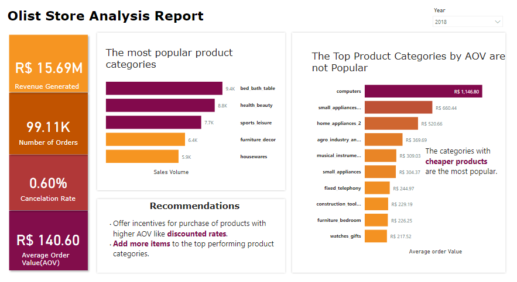
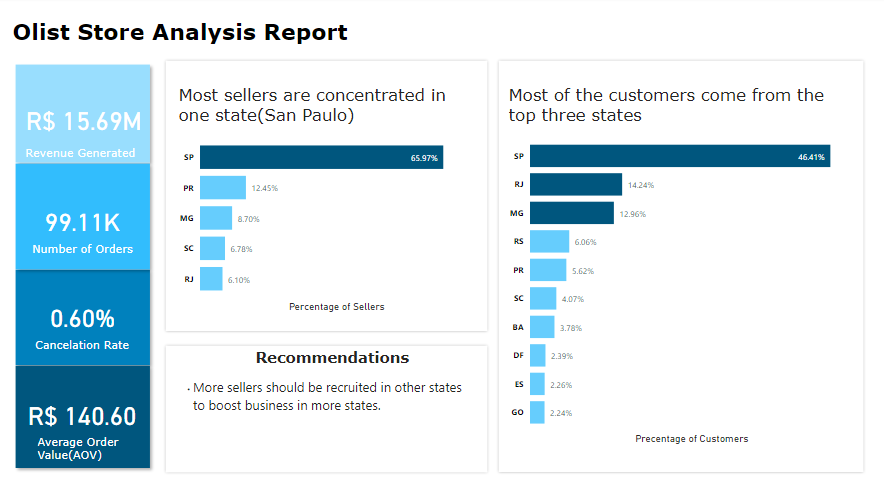

# 
 About the Project
This project is part of a data challange organized by a data community, aimed at showing and improving the skills of participants in data analysis. This project was completed using the following tools:
- Jupyter notebook(Python)
- SQL
- Power BI

# 
 About the Dataset
The Olist sales dataset available on Kaggle is a collection of anonymized data about orders
placed on the Olist platform between January 2017 and August 2018. It contains a wide range
of information about each order, including the order date, product details, payment and shipping
information, customer and seller IDs, and customer reviews. The dataset also includes
information about the sellers who list their products on Olist, as well as data on customer
behavior and demographics. The dataset is designed to help analysts and researchers better
understand the e-commerce landscape in Brazil and identify opportunities for growth and
optimization.

### 
Objective :
The objective of this analysis is to understand the e-commerce landscape in Brazil and identify opportunities for growth and
optimization. To help Olist gain better insights into their e-commerce platform and optimize available
opportunities for growth, you are to provide answers to the business questions below:

# 
 Analysis
**The project analysis is found in "April_DataChallenge/April_DataChallenge.ipynb**"

- ## STEPS for the analysis using python
- Import the data
- Data preparation
- Analysis by answering the business questions provided
- Insights/Recomendations

- ## Project was also executed using Power BI and Microsoft Excel
- After the necesary data preparation, the following reports were produced.
- 
- 
- 

## 
Key Insights

1. A high churn rate was observed
2. The top performing products had good rating.
3. A low order cancelation rate was observed.

## 
Recommendations

1. Organize marketing campaigns to imrove customer retention.
